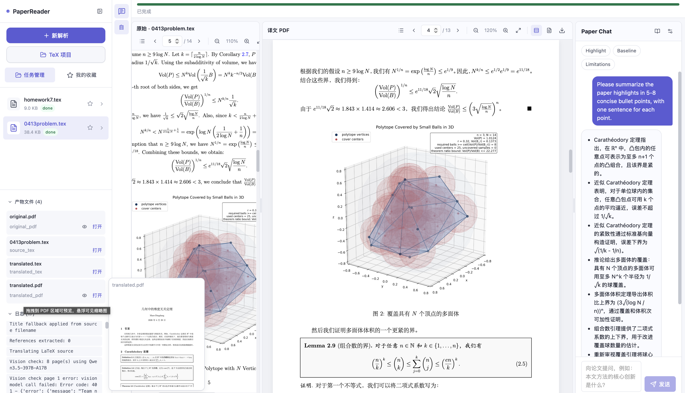

# Paper Reader MVP



A full-stack MVP for bilingual paper reading:
- Username/password account system with login, registration, remember-me session, and a personal center
- User-scoped persistent history backed by local SQLite; processed files can be reopened after restart
- Personal center for avatar upload, password change, and per-user LLM settings (`API Key` / `Base URL` / `Model`)
- Upload `.pdf`, single `.tex`, or a multi-file TeX project (Phase B)
- Parse PDF via the [MinerU](https://mineru.net/apiManage/docs) cloud API (精准解析, Bearer token)
- Concurrent LLM translation (Phase 优化) with placeholder protection, jittered retry and `Retry-After` honoring
- Vision-model adversarial check on each page (Qwen-class multimodal model, auto / manual review modes — Phase D)
- Three-layer LaTeX-failure prevention:
  1. **Prose sanitizer** rewrites raw Greek / math unicode (`ε`, `≤`, `→`, `Σ`…) into proper inline math
  2. **Force-fallback compile**: strict pass first, then `latexmk -f` so a PDF is still produced; surfaces `last_compile_warning`
  3. **Manual editor**: pencil button on the `translated.tex` artifact opens an in-browser editor that saves and recompiles
- Left/center/right reading workspace with toggleable Upload / Reader / Chat regions
- Show original and translated PDF side-by-side
- Progress bar with stage breakdown and ETA (Phase A)
- Artifact panel with scrolling, hover thumbnail preview, and drag-into-PDF-pane (Phase C)
- Chat with paper context via OpenAI-compatible API; full Markdown + GitHub-flavored tables + KaTeX math + soft line breaks for both user and assistant bubbles
- **Light / dark theme**: persists per user account via backend settings
- Sidebar toolbar consolidates Chat-visibility / Vision-check tri-state / Status-refresh / Theme buttons; collapsing the sidebar only hides the sidebar (the PDF + chat workspace keeps the full width)
- Premium interactions: generated-file list, reference preview, and template prompts (Highlight/Baseline/Limitations)

## Project Tree

```text
PaperReader/
├── backend/
│   └── app/
│       ├── api/
│       │   ├── routes_auth.py
│       │   ├── routes_chat.py
│       │   ├── routes_document.py
│       │   └── routes_upload.py
│       ├── core/
│       │   ├── config.py
│       │   └── database.py
│       ├── models/
│       │   ├── schemas.py
│       │   └── store.py
│       ├── services/
│       │   ├── auth_service.py
│       │   ├── document_pipeline.py
│       │   ├── latex_service.py
│       │   ├── llm_client.py
│       │   ├── mineru_service.py
│       │   └── translate_service.py
│       ├── workers/
│       │   └── tasks.py
│       └── main.py
├── frontend/
│   ├── src/
│   │   ├── components/
│   │   │   ├── AuthScreen.tsx
│   │   │   ├── ChatPanel.tsx
│   │   │   ├── PdfPane.tsx
│   │   │   ├── ProfileModal.tsx
│   │   │   └── Sidebar.tsx
│   │   ├── lib/
│   │   │   └── api.ts
│   │   ├── pages/
│   │   │   └── ReaderPage.tsx
│   │   ├── App.tsx
│   │   ├── main.tsx
│   │   └── styles.css
│   ├── index.html
│   ├── package.json
│   ├── tsconfig.json
│   └── vite.config.ts
├── data/
│   ├── outputs/
│   ├── paperreader.db
│   └── uploads/
├── infra/
│   └── Dockerfile.backend
├── scripts/
│   ├── setup_linux.sh
│   ├── setup_macos.sh
│   └── setup_windows.ps1
├── .env.example
├── docker-compose.yml
├── Makefile
├── plan.md
├── README.md
└── requirements.txt
```

## Python Dependencies (full list)

From `requirements.txt`:

- fastapi==0.115.0
- uvicorn[standard]==0.30.6
- python-multipart==0.0.9
- pydantic==2.9.2
- pydantic-settings==2.5.2
- openai==1.51.2
- requests==2.32.3
- celery==5.4.0
- redis==5.0.8
- httpx==0.27.2
- pytest==8.3.3
- pypdf==4.3.1
- pypdfium2==4.30.0

## Environment Setup

1. Copy environment file:

```bash
cp .env.example .env
```

2. Fill `.env` with your OpenAI-compatible endpoint/key.

### Required variables

- `OPENAI_API_KEY`
- `OPENAI_BASE_URL`
- `OPENAI_MODEL`
- `MINERU_API_KEY` (apply at https://mineru.net/apiManage/docs)
- `AUTH_SECRET_KEY` for local session signing/encryption in account mode

### Optional / tuning variables

- `SQLITE_DB_NAME` (default `paperreader.db`) — local persistent DB file under `DATA_DIR`.
- `SESSION_DAYS` (default `1`) — normal login session lifetime.
- `REMEMBER_ME_DAYS` (default `30`) — remember-me session lifetime.
- `TRANSLATE_CONCURRENCY` (default `4`) — number of parallel chunk translations.
- `TRANSLATE_MAX_RETRIES` (default `5`) — retry budget per LLM call; uses jittered exponential backoff and respects `Retry-After`.
- `LLM_RATE_LIMIT_RPS` (default `4`) — global token-bucket cap on LLM requests per second across all worker threads. Set to `0` to disable. Tune below the provider/key's published RPM to avoid 429s. Note: this limiter is per uvicorn process; if you scale to N workers, the effective limit becomes `N × LLM_RATE_LIMIT_RPS`.
- `TRANSLATE_BATCH_MAX_CHARS` (default `6000`) — max joined character length per IR batch request. Larger values amortize round-trip latency at the cost of larger per-call payloads.
- `VISION_MODEL` (default `GLM-4.5V`) — multimodal model used by the Phase D vision check. Must be a vision-capable model accessible via the same OpenAI-compatible endpoint as `OPENAI_BASE_URL` (e.g. `GLM-4.5V`, `GLM-4.6V`, `Qwen3-VL-30B-A3B-Instruct`, `Qwen3-VL-235B-A22B-Instruct`).
- `VISION_CHECK_ENABLED` (default `true`), `VISION_CHECK_MODE` (`auto` | `manual`), `VISION_CHECK_MAX_PAGES` (default `8`) — toggle/limit Phase D check.
- `LATEXMK_PATH` — absolute path to `latexmk` if not on `PATH`.

### MinerU PDF parsing

PDF parsing now goes through the MinerU 精准解析 API (no local OCR / GPU /
large model downloads required). Tunables (all optional except the API key):

- `MINERU_API_KEY` — Bearer token from your MinerU account.
- `MINERU_BASE_URL` — defaults to `https://mineru.net/api/v4`.
- `MINERU_MODEL_VERSION` — `vlm` (recommended), `pipeline`, or `MinerU-HTML`.
- `MINERU_LANGUAGE` — `en` for English papers, `ch` for Chinese, etc.
- `MINERU_ENABLE_FORMULA`, `MINERU_ENABLE_TABLE`, `MINERU_IS_OCR` — feature flags.
- `MINERU_POLL_INTERVAL` (seconds), `MINERU_TIMEOUT` (seconds) — polling control.

Limits enforced by MinerU: file ≤ 200 MB, ≤ 200 pages, 1000 high-priority
pages/day per account. Network egress to `mineru.net` and the returned
OSS/CDN hosts must be allowed.

## Local Run (recommended with conda)

Use the project conda env for all commands:

```bash
conda activate d2l
```

### 1. Install dependencies

后端 Python 依赖：

```bash
pip install -r requirements.txt
```

前端 Node 依赖（首次启动或 `package.json` 变更后执行）：

```bash
npm --prefix frontend install
```

如需在升级旧环境后避免二进制/接口不兼容，可强制重装：

```bash
pip install --force-reinstall -r requirements.txt
```

### 2. 启动服务

推荐使用项目根目录下的 Makefile 快捷命令（每条命令请在独立终端中运行）：

```bash
# 终端 1：启动后端 (FastAPI + Uvicorn, 默认 http://localhost:8000)
make backend

# 终端 2：启动前端 (Vite Dev Server, 默认 http://localhost:5173)
make frontend

# 终端 3（可选）：启动 Celery Worker，用于后续异步任务扩展
make worker
```

等价的原始命令：

```bash
# 后端
cd backend
uvicorn app.main:app --reload

# 前端
cd frontend
npm run dev

# Worker（可选）
celery -A app.workers.tasks worker -l info --workdir backend
```

启动后在浏览器打开：<http://localhost:5173>

### 3. 前端构建与预览（可选）

```bash
npm --prefix frontend run build      # 产出 frontend/dist
npm --prefix frontend run preview    # 本地预览生产构建
```

### 4. 常用校验

```bash
pytest                               # 运行后端测试
python -m compileall backend/app     # 快速语法检查
```

> 提示：上传与解析在请求链路中是同步执行的，处理较大 PDF 时前端会持续轮询 `GET /api/document/{id}` 直至 `status` 变为 `done` 或 `failed`。

## Account System

- All upload, project, history, chat, review, and recompile APIs now require login.
- Login uses username + password and an HttpOnly session cookie.
- `记住我` extends the cookie lifetime; it does not store the password in plaintext.
- User data is persisted in local SQLite:
  - `users`
  - `sessions`
  - `user_settings`
  - `documents`
  - `projects`
- User-scoped settings now include:
  - theme
  - vision-check preference
  - favorites
  - personal `API Key` / `Base URL` / `Model`

### Personal center

After login, the sidebar account area opens a personal center where users can:

- upload/change avatar
- rename username
- change password
- configure personal LLM settings
- manage persistent reading preferences

Chat uses the current user's saved LLM settings by default. If they are empty, backend `.env` defaults are used.

## Docker Run

```bash
docker compose up --build
```

Services:
- Frontend: `http://localhost:5173`
- Backend: `http://localhost:8000`
- Redis: `localhost:6379`

## API Endpoints

- `GET /health`
- **Auth / profile**
  - `POST /api/auth/register`
  - `POST /api/auth/login`
  - `POST /api/auth/logout`
  - `GET /api/auth/me`
  - `PATCH /api/auth/profile`
  - `POST /api/auth/change-password`
  - `POST /api/auth/avatar`
  - `PUT /api/settings/me`
- `POST /api/upload` (multipart file: `.pdf` or `.tex`; form fields `vision_check_enabled`, `vision_check_mode`)
- `GET /api/documents` — 列出当前登录用户的文档摘要
- `GET /api/document/{document_id}`
- `DELETE /api/document/{document_id}` — 软删除当前用户的一条历史记录
- `POST /api/chat`
- **Project (Phase B)**
  - `POST /api/project` — 创建 TeX 项目
  - `GET /api/project/{project_id}` — 查看文件与主文件候选
  - `POST /api/project/{project_id}/files` — 多次上传项目文件
  - `POST /api/project/{project_id}/delete-files`
  - `POST /api/project/{project_id}/build` — 选定主 `.tex` 后启动编译流水线
- **Vision review (Phase D)**
  - `POST /api/document/{document_id}/review` — 接受 / 拒绝视觉模型提出的修订
- **Manual TeX recompile**
  - `GET /api/document/{document_id}/tex` — 读取当前 `translated.tex`
  - `POST /api/document/{document_id}/tex` — 保存修改后重新编译（源文件先经 `latex_sanitizer` 清洗，并启用 strict→`-f` 降级编译）

### `GET /api/document/{document_id}` response highlights

Now includes:
- `source_filename`
- `updated_at`, `last_opened_at`
- `artifacts` (uploaded and generated files)
- `references` (extracted bibliography entries for preview)
- `progress`, `current_stage`, `current_stage_label`, `eta_seconds`, `stages` (Phase A)
- `pending_reviews` — vision-model proposals awaiting human decision in `manual` mode (Phase D)
- `last_compile_warning` — set when the strict LaTeX pass failed but the lenient `-f` pass still produced a PDF; the UI surfaces this so users can open the manual TeX editor for cleanup
- plus existing `status`, `original_pdf_url`, `translated_pdf_url`, `logs`

### Chat payload

```json
{
  "document_id": "uuid",
  "message": "What is the main contribution?",
  "override_api_key": "",
  "override_base_url": "",
  "override_model": ""
}
```

`override_*` fields are optional. In the current UI, chat normally uses the logged-in user's saved personal settings.

## Platform Notes

### macOS (Apple Silicon)
- PDF parsing now runs in the cloud via MinerU; no local Torch/MPS setup is required.
- If LaTeX compilation fails, install TeX Live + `latexmk` and Chinese fonts.

### Linux (CUDA)
- No GPU required for PDF parsing (MinerU is cloud-based).
- LLM translation still uses the OpenAI-compatible endpoint configured in `.env`.

### Windows
- Use `scripts/setup_windows.ps1`
- Install TeX Live + `latexmk` and ensure executable in PATH.

## Current MVP Boundaries

- Upload processing is still synchronous in request path (no background job handoff yet); translation chunks within a document are run concurrently via a thread pool.
- Document/project/account state is persisted in SQLite, but the app is still designed for local/small-scale deployment rather than hardened internet-scale multi-tenant use.
- Reference extraction is heuristic (section/line-pattern based), not a full citation parser.
- Frontend supports login/register, a personal center, panel toggles, drag-and-drop artifact preview, vision-check manual review and an in-browser `translated.tex` editor.
- LaTeX compile uses a strict pass first, then a lenient `-f` pass so the pipeline rarely ends in hard failure; warnings are surfaced via `last_compile_warning` and the manual editor lets users patch the source and recompile in-place.
